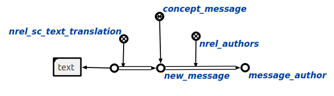

Speech recognition module for OSTIS
============

About
------------
This is speech recognition module for OSTIS. More info about installation and etc. you can find on [ostis-example-app](https://github.com/ostis-apps/ostis-example-app).

Result of recognition saves to knowledge base in structure that displayed below:

Requirements
------------

For requirements installation use

    pip3 install -r requirements.txt

---
**NOTE**

Install `pip3` before. For this use:

    sudo apt install python3-pip

---

Installation
------------

Add this line to CMakeLists.txt:

	add_subdirectory(SpeechRecognitionModule)
